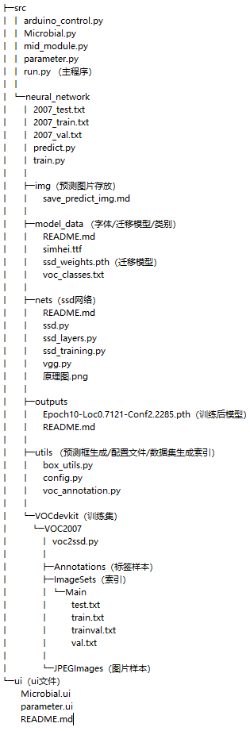
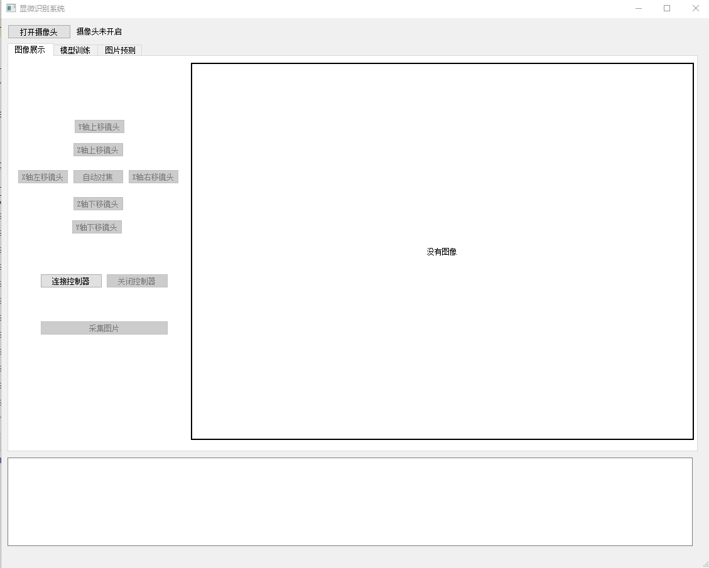
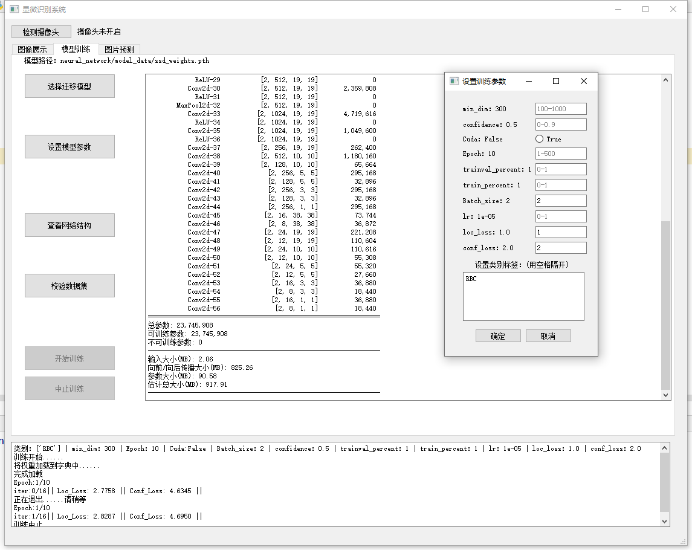
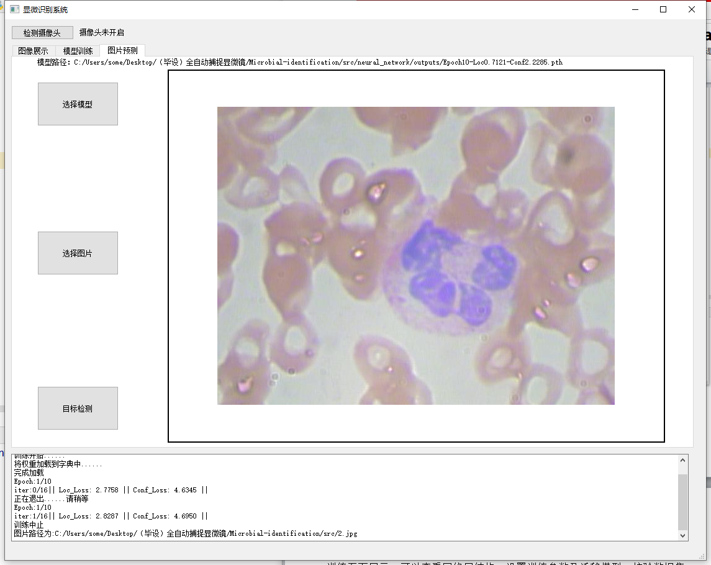
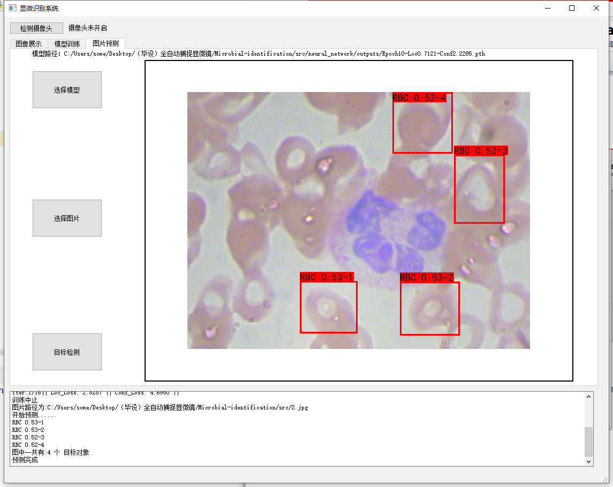

# Microbial-identification
 ## 前言

 Graduation project

本人博客：paniford.com

本项目主要使用arduino+Raspberry Pi 3B+deep learning（SSD网络）+python3 实现微生物图像识别。

**项目结构**



## 使用框架及工具包：

- python 3.7.3 （64bit 一定要64位，不然无法安装pytorch）
- torch==1.4.0
- PyQt5==5.14.2
- numpy==1.18.1
- distributed==2.1.0
- Pillow==7.1.2
- opencv_python==4.2.0.32
- pyserial==3.4 (arduino通信)
- matplotlib==3.1.3
- labalimg

 

## 使用说明

### 运行

- 安装环境

在项目目录下安装所需包（首先需要有python3）

```
pip install -r requirements.txt
```
安装wheel
```angular2
pip install wheel
```

安装 pytorch
```angular2
pip install torch==1.4.0+cpu torchvision==0.5.0+cpu -f https://download.pytorch.org/whl/torch_stable.html
```

- 打开cmd 进入项目目录 运行主程序`Microbial-identification\src\run.py`

```
python3 run.py
```

### 准备条件

1）补充 `model_data` 目录下的迁移模型，具体看文件夹内 Readme

2）准备数据集并放置与 `VOCdevkit/VOC2007/JPEGImages` 文件夹下

3） 使用labimg生成与`VOCdevkit/VOC2007/JPEGImages`内图片对应的标签文件并存放于`VOCdevkit/VOC2007/Annotations`内

4） 启动`run.py` 在`模型训练`页面设置参数以及标签名称，一定要与标签文件内标注名称对应，多个标签空格隔开

5）训练完成后在`output`中产生的模型可以用于预测


### 注意事项

- 网络层报错检查类别文件，输入参数一定要和类别文件`neural_network/model_data/voc_classes.txt`中类别一一对应
- 项目删除目前无法使用cuda加速(虽然中间一部分加速的代码没有删除)，因为我的AMD不YES了，如果有机会换intel的显卡我回考虑一下改代码，博主原版代码中也是有cuda加速部分，可以参考增加


## 目前进展

- 使用PyQt5进行了外观初步构建,由arduino控制界面，模型训练界面，图片预测界面构成

- 目前已实现功能主要分为三大部分

  - 摄像头控制部分

    - 检测并连接摄像头
  - arduino通讯检测及步进电机控制
    - opencv拉普拉斯算子计算清晰度

  

  - 模型训练部分
    - SSD目标检测网络
      - 参数更改
      - 网络中间层参数数量信息打印
    - 数据集校验，生成索引文件
    - 多线程开始/中止训练

  

  - 模型预测部分
    - 选择训练完成模型进行预测标注
    - 结果打印

  

  

- 目前可以进行模型的参数设定，训练以及识别，权重模型和数据集需要下载，详情看文件内Readme


